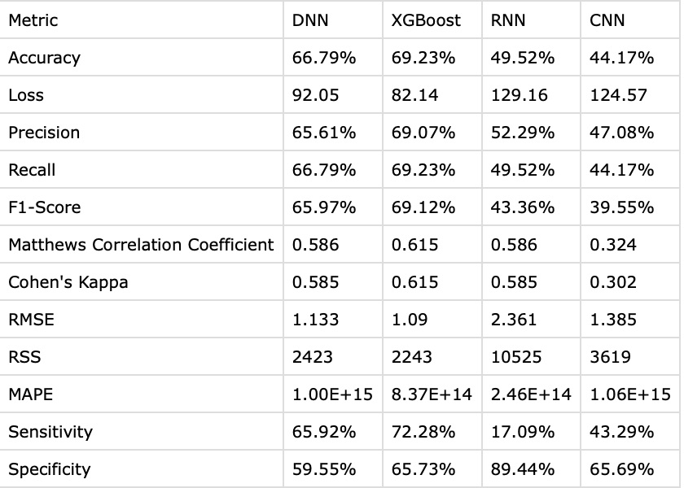

# Song Genre Prediction using Lyrics
This project uses Natural Language Processing (NLP) techniques and various machine learning models, such as Deep Learning, XGBoost, Recurrent Neural Networks (RNN), and Convolutional Neural Networks (CNN), to predict the genre of a song based on its lyrics. In addition to these models, custom helper functions are utilized from the functions.py file.


## Introduction

The goal of this project is to predict the genre of a song based on its lyrics using various machine learning models. The models are trained and evaluated on the Multilingual Lyrics for Genre Classification dataset from Kaggle, which contains lyrics in multiple languages with corresponding genre labels.

This project includes the implementation of different machine learning models such as:
 *	Fully Connected Neural Network (Deep Learning)
 *	XGBoost
 *	Recurrent Neural Network (RNN)
 *	Convolutional Neural Network (CNN)

Additionally, helper functions are provided in the `functions.py` file to streamline tasks such as data preprocessing and evaluation.

## Dataset

The dataset used in this project is the [Multi-Lingual Lyrics for Genre Classification](https://www.kaggle.com/datasets/mateibejan/multilingual-lyrics-for-genre-classification) dataset from Kaggle. It contains lyrics in multiple languages along with the corresponding genre labels. The dataset is already preprocessed and split into training and test sets for use in the models.


## Features
 * Lyrics Text: The lyrics of the song, which will be used as input for the models.
 * Genres: The output labels, indicating the genre of each song. Example genres include Pop, Rock, Hip-Hop, Country, Jazz, Metal, Classical, etc.

## Model Architecture
Here’s a brief overview of the models used:
 * Fully Connected Neural Network (Deep Learning): A simple feed-forward network with embedding and dense layers.
 * XGBoost: A gradient-boosting algorithm that excels in structured data problems.
 * Recurrent Neural Network (RNN): Uses LSTM layers to capture sequential dependencies in the lyrics.
 * Convolutional Neural Network (CNN): Applies 1D convolution layers to detect local patterns in the lyrics.


## Preprocessing

Text preprocessing includes tokenizing the lyrics, padding the sequences, and encoding the genre labels. The dataset is then fed into the models for training and evaluation.

Preprocessing steps:
Tokenization of lyrics, which consisted of sub-steps:
 *	Padding sequences to a uniform length (500 words).
 *	Encoding genre labels as integers.

The helper functions for preprocessing are located in the `functions.py` file.

# Installation
You need to have the following softwares installed on your machine:
  * [Python](https://www.python.org/downloads/)
  * [Anaconda Navigator](https://www.anaconda.com/products/distribution)
  * [Juypyter notebook](https://jupyter.org/install)

Follow the below steps to run the code in your local machine:
  1.	Clone the repository:
```bash
git clone https://github.com/Akashdip-N/Song-Genre-Prediction.git
```
  2. Create a virtual environment:
```bash
conda create --name myenv python=3.11.9
conda activate myenv
```
  
  3. Install the required packages:
```bash
pip install -r requirements.txt
```
  4.	Download the dataset from [Kaggle](https://www.kaggle.com/datasets/mateibejan/multilingual-lyrics-for-genre-classification) and place it in the /Dataset directory.
  
  5.	Ensure the `functions.py` file is in the root directory. This file contains helper functions for data preprocessing.

# Usage

To execute the code, follow the steps below:
  * Open the jupyter notebook
  * Open the file `song-genre-prediction.ipynb`
  * Run the cells

## Results
The results for each model based on accuracy, precision, and loss will be summarized in the form of a table and will look similar to the following:


## Contributing
Contributions are welcome! Please submit a pull request or open an issue to suggest any improvements or report bugs.

## License
This project is licensed under the MIT License - see the LICENSE file for details.
